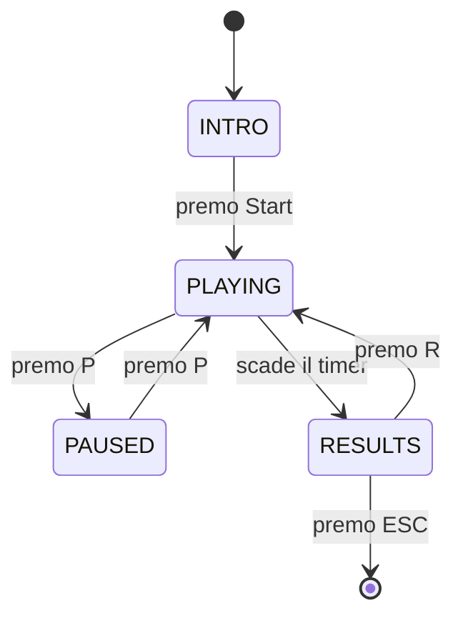

# Architettura

> Qui spiegate **come è fatto dentro** il progetto. Non ripetete il testo della specifica: scrivete cosa avete fatto voi, come lo avete organizzato, e perché.

## Decomposizione in moduli

Per ciascun modulo del vostro progetto, una-due righe:

- `main.py` — File principale in cui viene gestito l'event loop e lo stato del gioco. 
- `config.py` — File dove sono definite le costanti globali del gioco da importare nei file che le devono usare.
- `models.py` — Il model del gioco, viene definita la classe Trial. Non importa pygame.
- `rules.py` — Vengono definite le regole del gioco, come il controllo se il numero è pari o la lettera è una vocale. Inoltre definisce la risposta che il gioco si aspetta.
- `scoring.py` — File in cui viene gestito il sistema di punteggio, che assegna 10 punti alla risposta corretta e ne toglie 5 alla risposta sbagliata. Inoltre è qui definito il moltiplicatore.
- `generator.py` — File in cui viene definita la funzione che genera un oggetto Trial
- `states.py` — File in cui viene definita la classe Enum per tenere traccia dello stato del gioco. Utile in main.py.
- `ui.py` — La view del gioco, in cui sono definite tutte le funzioni che si occupano del disegno.
- `input_handler.py` — Il controller del gioco, che intercetta e gestisce gli input dell'utente. Viene richiamato in main.py
- `timer.py` — File in cui vengono definite le funzioni per disegnare la barra del timer.

## Separazione logica / presentazione

I moduli puri sono config.py, generator.py, state.py, scoring.py e models.py, che rappresentano il modello e la logica dell'applicazione, modificando quindi variabili interne al gioco poi utilizzate per disegnare il gioco da timer.py, ui.py che rappresentano la view. Model e view comunicano in input_handler.py e main.py, che fanno da controller e importano pygame.

## Macchina a stati

Diagramma della macchina a stati (Mermaid va benissimo, è supportato da GitHub):

Lo stato INTRO serve per disegnare la schermata di avvio, e può transire nella Schermata PLAYING, che invece gestisce il gioco vero e proprio e può transire in PAUSED, che renderizza la schermata di pausa, e in RESULTS quando il tempo finisce. RESULTS può transire in PLAYING e serve per renderizzare la schermata di fine.

## Flusso di un trial

1. Nascita (generator.py): La funzione generate_trial() estrae casualmente posizione (TOP/BOTTOM), lettera e numero. Chiama subito rules.py per calcolare e salvare la risposta corretta attesa (expected_answer) in una dataclass Trial.
2. Esposizione (ui.py): Il ciclo principale in main.py passa il Trial attivo a ui.py, che si occupa di renderizzare la carta nella posizione corretta e di mostrare il testo di aiuto dinamico.
3. Input (input_handler.py): handle_inputs() intercetta la tastiera o il clic sui pulsanti del mouse e unifica l'azione in un'unica flag booleana (user_answer), restituendola al main.
4. Valutazione e Scoring (main.py + scoring.py): Il main.py confronta user_answer con expected_answer. Aggiorna i contatori di risposte totali/corrette/errate e la streak, poi chiama scoring.py per modificare il punteggio base e applicare i moltiplicatori delle serie.
5. Feedback e Archiviazione (main.py): Il main.py colora temporaneamente la carta (Verde/Rosso) e imposta la durata del feedback visivo. Subito dopo, sovrascrive la variabile del Trial corrente generandone uno nuovo. I dati del vecchio Trial restano archiviati solo come statistiche aggregate nei contatori del main.

## Dati principali

La dataclass definita in models.py è Trial e server per la gestione e validazione di un singolo tentativo da parte dell'utente

## Scoring: come è implementato

Lo scoring è inserito in scoring.py ed è fatto in modo che una risposta corretta dia 10 punti e una risposta incorretta ne tolga 5. Inoltre è inserito un moltiplicatore che moltiplica la streak attuale per un numero sempre più grande.

## Fading istruzioni

Il testo di aiuto svanisce progressivamente con l'aumentare delle risposte corrette del giocatore secondo questa logica:

* Stato della variabile: Il contatore delle risposte esatte vive nella variabile locale correct_answers all'interno di main.py (inizializzata a 0 e azzerata al reset).
* Aggiornamento: Viene incrementata di 1 direttamente dal main.py ogni volta che viene rilevata una risposta corretta.
* Calcolo dell'Alpha: La funzione draw_hints() riceve questo contatore e calcola l'opacità (da 0 a 255) con la formula: alpha = max(0, 255 - (correct_answers * 25)). Ogni risposta corretta riduce l'opacità di 25 punti. Raggiunte le 10 risposte corrette, l'alpha si azzera e il rendering si interrompe per ottimizzare le prestazioni.
* Rendering in Pygame: ui.py applica la trasparenza al testo tramite .set_alpha(alpha). Per il box di sfondo e la sua ombra, disegna su una superficie speciale (pygame.SRCALPHA) inserendo il valore di alpha nel canale di trasparenza RGBA del colore del rettangolo.

---
